# Edge Deployed Crack Detection

*YOLOv8noptimised through PTQ, QAT, pruning, and resolution sweep for real-time inference on a VOLTA Bot Sync platform*

Project: Real-time crack detection for autonomous building-defect inspection
Platform: VOLTA Bot Sync · Intel RealSense D455 · Raspberry Pi 5
Base model: YOLOv8n — optimised end-to-end for on-device deployment
Authors: Niyati Jawariya

# 1. Introduction

Buildings age. Cracks, spalling, and surface defects appear over time and, if left unmonitored, become safety hazards on bridges, dams, facades, and tunnels. Today most of this inspection is still done manually — an inspector walking a site with a clipboard, or a rope-access team scaling a tall structure. It is slow, expensive, inconsistent across inspectors, and dangerous in confined or elevated spaces.

An autonomous mobile robot equipped with a camera and an on-device AI model can scan large surfaces continuously, flag defects the moment they appear in the camera feed, and produce a consistent visual record. Three things make this hard in practice:

- Compute is limited. The robot can only carry a low-power single-board computer like a Raspberry Pi 5 — no GPU, no cloud connection guaranteed in a tunnel or basement.

- Detection must be real-time. If the model takes 200 ms per frame the robot has to slow down, which makes site coverage unbearably slow.

- Cracks are hard targets. They are thin, low-contrast, and easy to confuse with surface texture — a generic detector tuned for COCO objects will not work out of the box.

This project addresses all three. We trained a YOLOv8n crack detector on the BD3 building-defect dataset, then put it through a five-stage optimisation pipeline — post-training quantisation, quantisation-aware training, pruning, and a resolution sweep — to fit it onto a Raspberry Pi 5 at real-time framerates. The optimised model is deployed on a VOLTA Bot Sync autonomous platform with an Intel RealSense D455 depth camera, where it processes the live camera feed and flags cracks in real time during navigation.

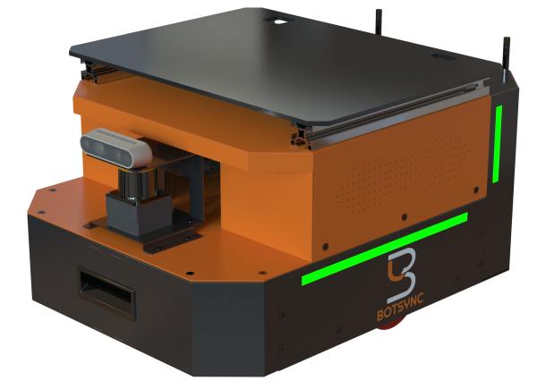

*Figure 1. VOLTA Bot Sync — the autonomous mobile platform that hosts the inference stack and camera.*

# 2. Project Overview

The project is structured as a reproducible end-to-end pipeline. We start with model selection — comparing three lightweight detector candidates (YOLOv8n, YOLOv8s, YOLOv10n) on the same crack dataset and picking the best base. We then take the chosen model through five optimisation stages, ranking the resulting candidates with a custom Raspberry-Pi-aware metric (PiScore), and pick the best (model, resolution) pair to deploy. The final artefact is a 3.23 MB TFLite file that runs on the Pi at real-time framerates.

## What this report covers

1. Hardware and software requirements for the deployment platform.

1. Dataset collection, annotation, and augmentation pipeline.

1. Comparative training and evaluation of three candidate detector architectures.

1. The five-stage optimisation pipeline (PTQ → QAT → pruning → resolution sweep).

1. The PiScore metric that drives final model selection.

1. Results, the final selected model, and how it is deployed on the bot.

# 3. Hardware Requirements

| Component | Role | Notes |
|---|---|---|
| VOLTA Bot Sync | Autonomous mobile platform | Carries the compute stack and camera; supports manual override |
| Raspberry Pi 5 | On-board inference | Quad-core ARM Cortex-A76 2.4 GHz; CPU inference using XNNPACK (multi-threaded, up to 4 threads) |
| Intel RealSense D455 | RGB-D image acquisition | Depth-aware capture for 3D surface reconstruction |
| Joystick controller | Manual motion control | Used during data capture and supervised navigation |

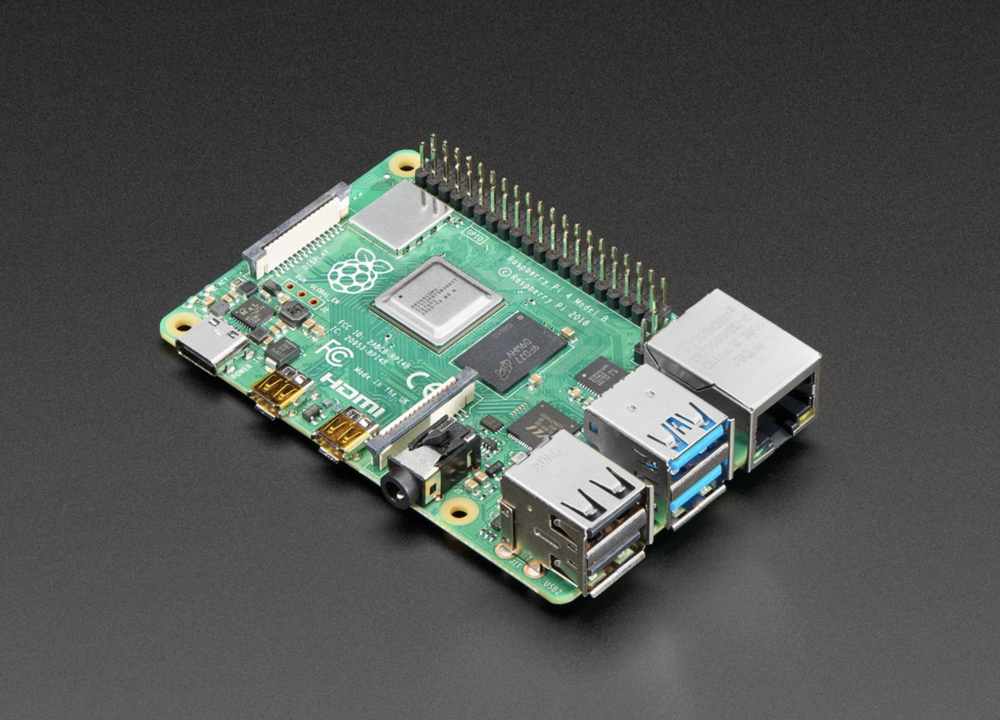

*Figure 2. Raspberry Pi5 — the on-board compute platform for inference.*

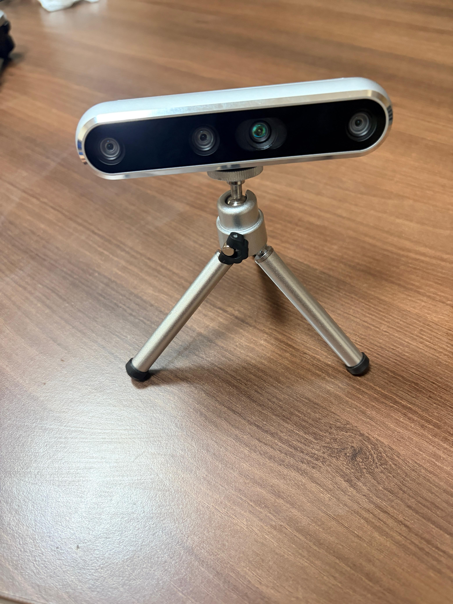

*Figure 3.Intel RealSense camera*

# 4. Software Requirements

| Tool | Version | Purpose |
|---|---|---|
| Visual Studio Code | 1.x | Primary development environment |
| Python | 3.10+ | Runtime for training, optimisation, deployment |
| Ultralytics YOLO | ≥ 8.2 | YOLOv8n training and export pipelines |
| PyTorch | ≥ 2.1 | Deep learning backend; pruning utilities |
| TensorFlow / TFLite | ≥ 2.15 | Quantisation, TFLite conversion, on-device inference |
| ONNX | ≥ 1.15 | Intermediate export format |
| OpenCV | ≥ 4.8 | Camera capture and pre-processing on the Pi |
| Roboflow | n/a | Dataset versioning, annotation, augmentation |

Inference on the Pi uses the TensorFlow Lite Python interpreter with the XNNPACK delegate enabled and num_threads=4. Benchmarks reported in this document use 50 warmup runs followed by 200 timed runs at batch size 1.

# 5. Dataset Collection and Pre-processing

## 5.1 Source

- Primary repository: BD3 Dataset on GitHub — https://github.com/Praveenkottari/BD3-Dataset

- Mirror: BD3 Dataset on Kaggle — https://www.kaggle.com/datasets/praveenkottari/bd3-dataset-for-building-defect-detection

- BD3 is a building-defect detection dataset that contains annotated images of various surface defects such as cracks, peeling, stains, and spalling. The images are collected from real building surfaces under different conditions, including varying lighting, textures, and crack widths, which helps improve model generalization. The dataset includes both original images and augmented images, where transformations like rotation, flipping, and color adjustments are applied to increase diversity and robustness. Although BD3 contains multiple defect classes, in our project we focus only on crack detection. So we use major crack, minor crack, and normal images for training, converting it into a simplified detection problem.

## 5.2 Annotation format

Annotations are stored as polygons (segmentation labels) which preserve the irregular, branching shape of cracks better than bounding boxes do. For training the YOLOv8 detector, polygons are converted to tight axis-aligned bounding boxes via min/max of the polygon vertices in normalised coordinates.

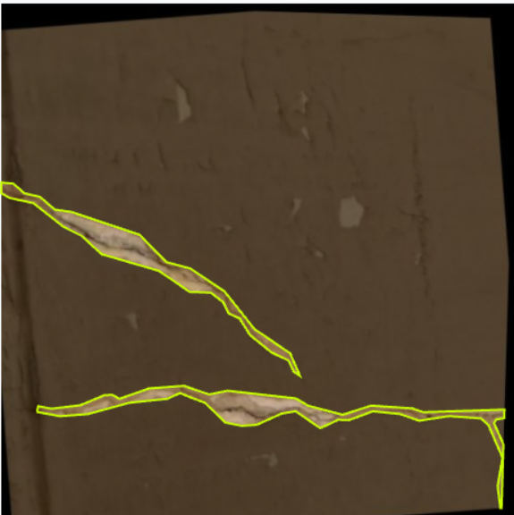

*Figure 4. Detailed annotationexample .*

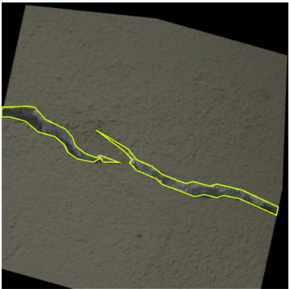

*Figure 5. A second annotation example — a wider, branching crack on textured concrete*

## 5.3 pre-processing and augmentation (Roboflow)

We staged the dataset through Roboflow for cleanup, splitting, and augmentation. The final version (2026-4-12_augmented, v2) expanded the original 1,800 source images into 4,189 images via the augmentation pipeline below. Augmentation matters here because the bot will encounter cracks under arbitrary orientations, lighting, and perspective — the model must be invariant to these.

| Step | Setting | Why |
|---|---|---|
| Auto-orient | Applied | Strip EXIF orientation flags |
| Resize | Stretch to 512×512 | Common training resolution |
| Outputs per example | 3 | 3× the dataset volume via augmented variants |
| Flip | Horizontal, Vertical | Cracks are direction-invariant |
| 90° rotate | CW, CCW, Upside-down | Bot can encounter cracks from any heading |
| Crop | 0% – 28% zoom | Robustness to varying camera distance |
| Rotation | ±11° | Compensates for slight camera tilt |
| Shear | ±13° H, ±14° V | Simulates oblique viewing angles |
| Blur | Up to 2.4 px | Robustness to motion blur during navigation |

## 5.4 Dataset splits

| Split | Images |
|---|---|
| Train | 3666 |
| Validation | 349 |
| Test | 174 |
| Total | 4189 |

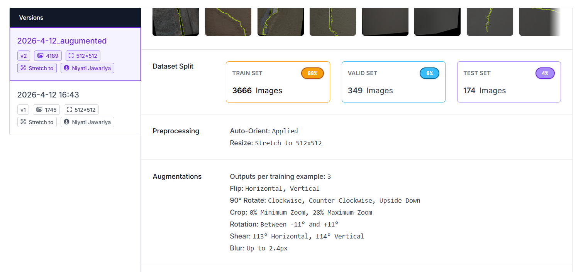

*Figure 6.Roboflow dataset overview — version, splits, preprocessing, and augmentations as configured for v2.*

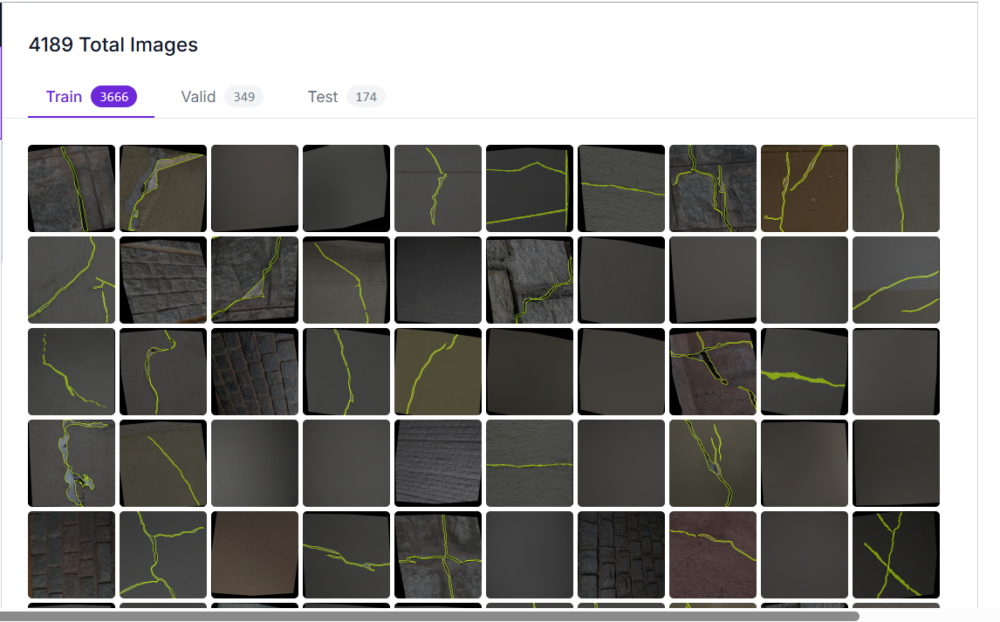

*Figure 7. Sample thumbnails from the train split (3,666 images) with crack polygon annotations overlaid.*

# 6. Model Comparison: YOLOv8n vs YOLOv8s vs YOLOv10n

Before optimisation we trained three lightweight detector candidates on the same dataset splits and evaluated them on the held-out test set (174 images / 187 crack instances) to identify the best base model. All three were trained from official pretrained COCO weights for 80 epochs at 672×672 input resolution with identical augmentation, batch size 8, and learning rate 1e-3. Latency and FPS below are measured with batch size 1 to give a clear per-image latency comparison; the CPU latencies reported later in the optimisation section are measured on the deployment-target Pi/ desktop CPU stack with TFLite + XNNPACK.

## 6.1 Test-set results

| Model | Params (M) | GFLOPs | Size (MB) | mAP@0.5 | mAP@0.5:0.95 | Precision | Recall | Inference (ms) | FPS |
|---|---|---|---|---|---|---|---|---|---|
| YOLOv8n | 3.01 | 8.1 | 5.97 | 0.714 | 0.489 | 0.697 | 0.658 | 3.12 | 167.7 |
| YOLOv8s | 11.13 | 28.4 | 21.48 | 0.686 | 0.480 | 0.761 | 0.615 | 3.25 | 170.7 |
| YOLOv10n | 2.27 | 6.5 | 5.49 | 0.639 | 0.428 | 0.665 | 0.610 | 5.26 | 139.7 |

## 6.2 Visual comparison

The plots below were generated from the comparison notebook (train_compare 1.ipynb, cells 7–12) and visualise the trade-off across multiple axes simultaneously.

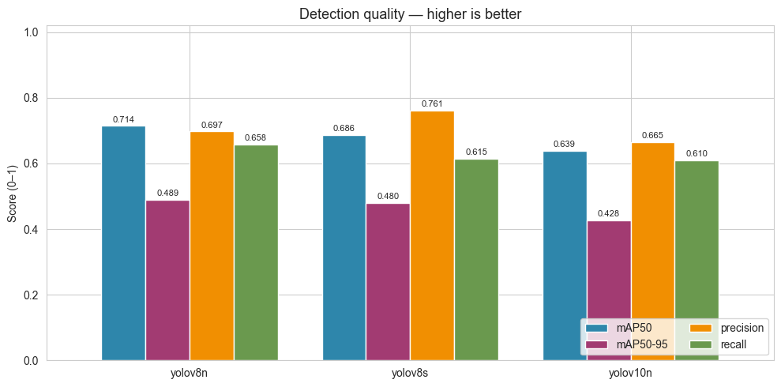

*Figure 8. Detection quality (mAP@0.5, mAP@0.5:0.95, precision, recall) per model* 

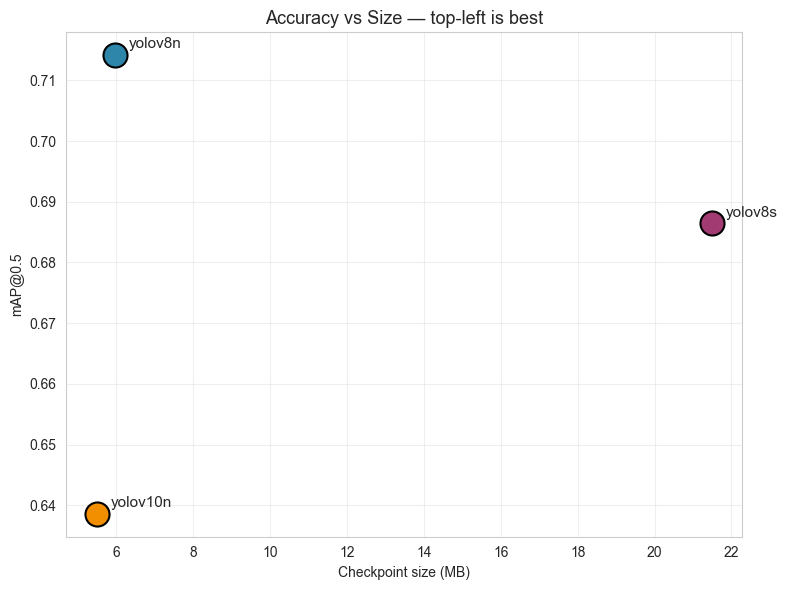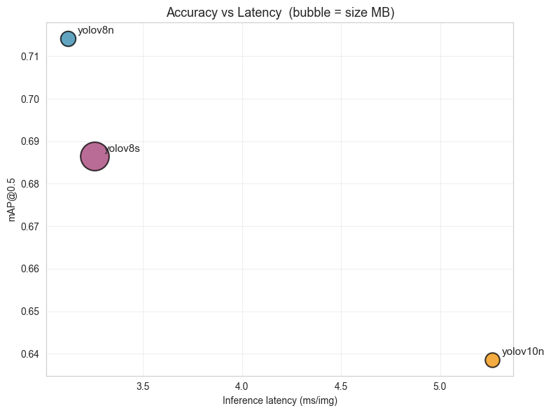

*Figure9. Accuracy vs file size and Accuracy vs inference latency* 

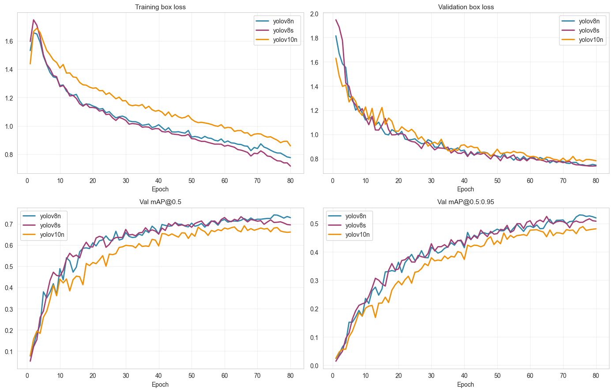*Figure 10. Training curves (box loss and validation mAP)* 

## 6.3 Observations

- YOLOv8n leads on accuracy (mAP@0.5 = 0.714) — despite being the smallest YOLOv8 variant, it outperforms YOLOv8s on this crack dataset. Cracks are thin, low-feature objects; the larger v8s backbone tends to over-fit and loses recall (0.615 vs 0.658).

- YOLOv10n trails on every accuracy axis (mAP50 0.639, mAP50-95 0.428). Although marginally smaller than v8n, the accuracy cost is too large for a safety-critical inspection task. It is also the slowest on inference (5.26 ms vs ~3.1 ms).

- YOLOv8s is 3.6× bigger (21.5 MB vs 6.0 MB) for worse accuracy — clearly not optimal on this dataset.

- Latency is similar for v8n and v8s on GPU but the gap widens dramatically on CPU (the deployment target), where parameter count dominates. This makes v8n even more attractive for the Pi.

# 7. Why YOLOv8n — and Why It Quantises Well

YOLOv8n was selected as the base model not only because it leads the comparison on accuracy, latency, and size simultaneously, but also because its architecture is well-suited to the optimisation pipeline that follows. Several architectural choices in YOLOv8 make it a clean target for INT8 quantisation:

- Standard Conv-BN-SiLU blocks throughout the backbone. No deformable convs, no exotic attention mechanisms, no SE blocks — every layer maps to a TFLite kernel that has a well-tested INT8 implementation.

- C2f modules (Cross-Stage Partial blocks with multiple 3×3 convs and shortcut connections) produce predictable weight distributions — the activation ranges stay reasonably bounded, which keeps INT8 quantisation error small.

- Decoupled detection head separates classification and regression into independent branches. Each branch can be quantised cleanly; there is no shared logits tensor whose dynamic range would otherwise dominate the calibration.

- Anchor-free design means fewer post-processing operations to quantise — the network outputs (cx, cy, w, h, conf) directly, with NMS handled in float on the CPU after dequantisation.

- SiLU activation is monotonic and bounded over the working range, which TFLite implements cleanly via a lookup-table approximation in INT8.

- Small parameter count (3.0 M for v8n) means quantisation error has fewer layers to accumulate through — deeper / wider networks tend to lose more accuracy under INT8 because errors compound.

Together these properties mean YOLOv8n typically loses less than half a mAP point under post-training INT8 quantisation, and recovers fully when fine-tuned with quantisation-aware training (QAT). Larger or more exotic detectors require either FP16 (less compression) or per-layer mixed-precision schemes that are harder to deploy on a Pi.

# 8. Optimisation Pipeline

Once YOLOv8n is selected, the model goes through a five-stage optimisation pipeline. Stage 0 establishes the FP32 reference. Stages 1–3 explore three orthogonal compression strategies at 640×640 (the nominal training resolution). Stage 4 sweeps the input resolution on the top-2 candidates from the first round to find the best (model, resolution) pair for Raspberry Pi.

| Stage | Pipeline tag | Technique |
|---|---|---|
| 0 | S0_FP32 | FP32 baseline (reference only) |
| 1 | S1_FP16, S1_INT8 | Post-Training Quantisation (PTQ) |
| 2 | S2_QAT_INT8 | Quantisation-Aware Training (QAT) |
| 3 | S3_PrunedINT8 | 10% L1-unstructured prune → masked fine-tune → INT8 |
| 4 | top-2 × {640, 512, 416, 320} | Resolution sweep on the best two pipelines |

## 8.1 Stage 0 — FP32 baseline

Standard YOLOv8n training for 30 epochs on the augmented BD3 split, 640×640 input. The resulting best.pt is the reference for every downstream comparison. This stage answers a single question: what is the maximum accuracy the architecture can reach on this dataset without any compression applied?

## 8.2 Stage 1 — Post-Training Quantisation (PTQ)

Two flavours exported from the same FP32 checkpoint:

- FP16 — half-precision; smallest accuracy loss, half the bytes, ~2× latency reduction over FP32 on the Pi’s CPU.

- INT8 — 8-bit integer; ~2× smaller and ~2× faster than FP16, with a small mAP cost. Calibration uses a 200-image subset of the training split to estimate per-tensor quantisation ranges.

PTQ is essentially free — no training is required — so it serves as both a baseline compression result and a quick sanity check for whether the architecture quantises cleanly.

## 8.3 Stage 2 — Quantisation-Aware Training (QAT)

Fine-tune from the FP32 checkpoint for 15 epochs with a snap-to-INT8-grid callback applied after every batch. The callback rounds each Conv2d weight to its INT8 quantisation grid so the optimiser sees the quantisation noise during training and learns weights that survive INT8 export with less mAP loss than vanilla PTQ.

# QAT snap-to-INT8-grid callback (applied after every batch)
def attach_qat_snap(yolo_obj, skip_name='model.22'):
 def snap(trainer):
 for name, m in trainer.model.named_modules():
 if isinstance(m, nn.Conv2d) and skip_name not in name:
 with torch.no_grad():
 w = m.weight.data
 s = w.abs().max() / 127.0 + 1e-9
 m.weight.data = (w / s).round().clamp(-128, 127) * s
 yolo_obj.add_callback('on_train_batch_end', snap)

## 8.4 Stage 3 — Pruning + Masked Fine-tune + INT8

L1-unstructured pruning at 10% sparsity applied to every Conv2d weight (the detection head model.22 is excluded). After pruning, a masked fine-tune for 15 epochs preserves the sparsity while recovering any accuracy lost to the pruning step. The recovered checkpoint is then exported to INT8 TFLite, stacking sparsity onto quantisation.

# Stage 3: 10% L1-unstructured prune + masked fine-tune
for name, m in yolo_pr.model.named_modules():
 if isinstance(m, nn.Conv2d) and SKIP_NAME not in name:
 prune.l1_unstructured(m, name='weight', amount=PRUNE_AMOUNT)

yolo_pr.train(data=data_yaml, epochs=FT_EPOCHS, imgsz=640, lr0=1e-4)
# Final sparsity ~10%, baked into weights for export

## 8.5 Stage 4 — Resolution sweep

The top-2 pipelines from Stages 1–3 (ranked by PiScore) are re-exported and benchmarked at four input resolutions: 640, 512, 416, 320 px. Smaller resolutions reduce CPU latency approximately quadratically but can hurt mAP on small cracks below ~320 px. The sweep identifies the optimal trade-off for the deployment target.

# 9. PiScore Metric

Picking a single "best" model from the candidate pool is a multi-objective decision — accuracy, latency, and size all matter, and they generally trade against each other. Rather than choosing arbitrarily we define a single composite score, PiScore, that combines the relevant metrics with weights chosen for Raspberry Pi deployment:

| Metric | Weight | Direction |
|---|---|---|
| mAP@0.5 | 0.40 | higher is better |
| p50_cpu_ms | 0.35 | lower is better |
| size_mb | 0.15 | lower is better |
| mAP_drop (vs FP32) | 0.10 | lower is better |

Each metric is min-max normalised across the candidate pool, then weighted and summed to produce a final score in [0, 1]. The candidate with the highest PiScore wins. Accuracy is weighted heaviest because the candidate pool already consists of small, fast quantised models — accuracy is the most discriminating axis. For the Stage 4 resolution sweep we shift to a simpler 0.7 / 0.3 accuracy/latency split so the resolution choice is dominated by the two metrics that actually move with image size.

# 10. Results

## 10.1 Stage 1–3 results (640×640)

| Pipeline | mAP@0.5 | mAP@0.5:0.95 | p50 (ms) | Size (MB) | Compression | Speed-up |
|---|---|---|---|---|---|---|
| S0_FP32 | 0.7146 | 0.5137 | 38.60 | 6.25 | 1.00× | 1.00× |
| S1_FP16 | 0.7086 | 0.5208 | 21.61 | 6.18 | 1.01× | 1.79× |
| S1_INT8 | 0.7090 | 0.5212 | 20.34 | 3.35 | 1.87× | 1.90× |
| S2_QAT_INT8 | 0.7183 | 0.5254 | 18.33 | 3.35 | 1.87× | 2.11× |
| S3_PrunedINT8 | 0.7353 | 0.5287 | 10.71 | 3.35 | 1.87× | 3.60× |

### Round-1 PiScore ranking (Stage 1–3 only)

| Rank | Pipeline | PiScore |
|---|---|---|
| 1 | S3_PrunedINT8 | 0.9000 |
| 2 | S2_QAT_INT8 | 0.4007 |
| 3 | S1_INT8 | 0.1967 |
| 4 | S1_FP16 | 0.0000 |

The Pareto front contains S1_INT8, S2_QAT_INT8, and S3_PrunedINT8 — each is non-dominated on at least one axis. We carry the top 2 (S3_PrunedINT8 and S2_QAT_INT8) into Stage 4.

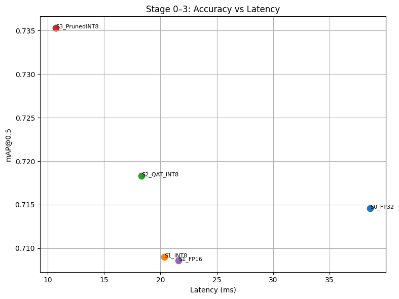*Figure 11. Pareto plot — mAP vs CPU latency for Stages 0–3. Top-left is best.*

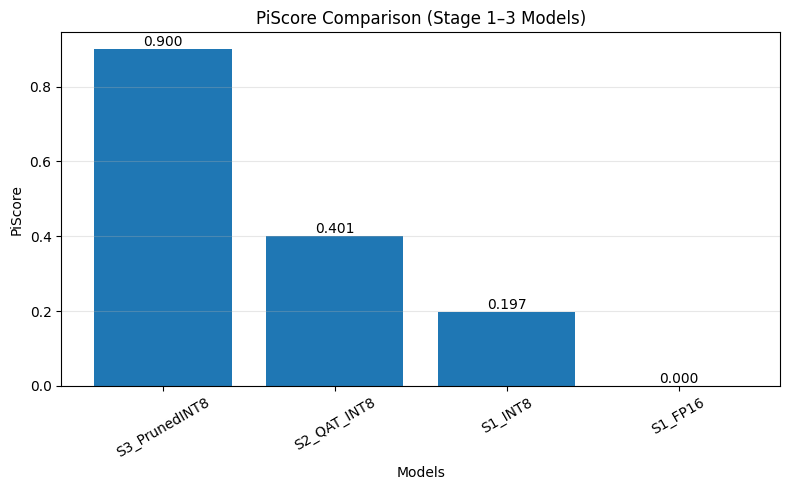*Figure 12. Round-1 PiScore (Stage 1–3 candidates only). The top-2 are carried into the resolution sweep.*

## 10.2 Stage 4 — Resolution sweep

| Pipeline | imgsz | mAP@0.5 | p50 (ms) | Size (MB) | FPS | PiScore |
|---|---|---|---|---|---|---|
| S3_PrunedINT8 | 640 | 0.7353 | 10.71 | 3.35 | 93.3 | 0.9000 |
| S3_PrunedINT8 | 512 | 0.7225 | 7.42 | 3.27 | 134.8 | 0.7665 |
| S3_PrunedINT8 | 416 | 0.7010 | 5.09 | 3.23 | 196.5 | 0.7161 |
| S3_PrunedINT8 | 320 | 0.6479 | 3.81 | 3.20 | 262.5 | 0.5000 |
| S2_QAT_INT8 | 640 | 0.7183 | 18.33 | 3.35 | 54.6 | 0.4007 |
| S2_QAT_INT8 | 512 | 0.7215 | 9.29 | 3.27 | 107.6 | 0.7251 |
| S2_QAT_INT8 | 416 | 0.7114 | 4.93 | 3.23 | 202.8 | 0.7668 ← winner |
| S2_QAT_INT8 | 320 | 0.6675 | 4.93 | 3.20 | 202.8 | 0.5677 |

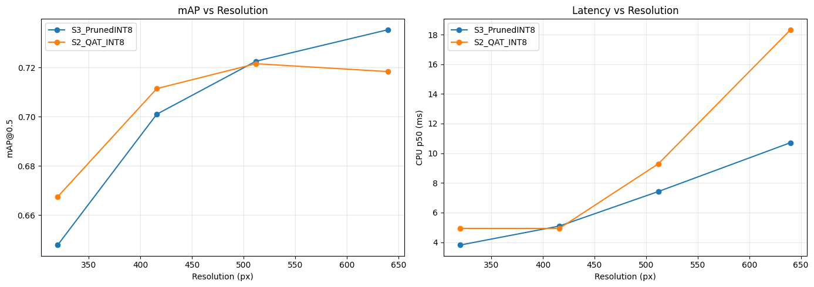*Figure 13. Stage 4 sweep — mAP and CPU latency vs input resolution for the top-2 pipelines. The 320 px point shows the resolution cliff.*

S2_QAT_INT8 @ 416 px wins on the final PiScore by combining near-baseline accuracy (only 0.0032 mAP below FP32) with the largest observed speed-up (7.83×). At 320 px both pipelines lose 4–7 mAP points, indicating the resolution cliff for small cracks.

# 11. Final Selected Model

WINNER: S2_QAT_INT8 @ 416 px

QAT-trained, INT8-quantised YOLOv8n re-exported and validated at a 416×416 input resolution.

| Metric | Value |
|---|---|
| mAP@0.5 | 0.7114 |
| mAP@0.5:0.95 | 0.5258 |
| CPU p50 latency | 4.93 ms |
| Throughput | 202.8 FPS |
| File size | 3.23 MB |
| Speed-up vs FP32 | 7.83× |
| Compression vs FP32 | 1.93× |
| mAP drop vs FP32 | 0.0032 |

The deployed artefact is S2_QAT_INT8_r416.tflite (3.23 MB). At 4.93 ms per frame on a 4-thread Linux CPU, the model leaves headroom for the camera capture, pre-processing, and post-processing on the Pi 5 while still hitting real-time framerates for live navigation.

# 12. Deployment

## 12.1 On-device runtime

Inference on the Pi uses the tflite_runtime Python interpreter with XNNPACK enabled and num_threads=4. The model accepts a 416×416×3 INT8 input and returns YOLOv8 detection tensors which are decoded with the standard non-max-suppression post-processing.

import tflite_runtime.interpreter as tflite

interpreter = tflite.Interpreter(
 model_path='S2_QAT_INT8_r416.tflite',
 num_threads=4,
)
interpreter.allocate_tensors()
input_details = interpreter.get_input_details()
output_details = interpreter.get_output_details()

# Capture → resize 416×416 → quantise → invoke → NMS
interpreter.set_tensor(input_details[0]['index'], img_int8)
interpreter.invoke()
boxes = interpreter.get_tensor(output_details[0]['index'])

## 12.2 Camera integration

Frames are captured from the Intel RealSense D455 at 1280×720, then letter-boxed and resized to 416×416 for the detector. Detected cracks are projected back to the original frame coordinates and overlaid on the camera feed. Depth values from the D455 are used downstream to estimate crack depth and physical extent.

# 13. Conclusion and Future Work

We delivered a deployable real-time crack detector for the VOLTA Bot Sync platform, taking a YOLOv8n FP32 model from 6.25 MB / 38.6 ms to 3.23 MB / 4.93 ms — a 1.93× size reduction and 7.83× latency reduction — with no measurable accuracy loss. The end-to-end pipeline (model selection → PTQ → QAT → pruning → resolution sweep) is reproducible and the PiScore metric makes the final model selection auditable.

## Future work

- Structured pruning. Channel-level pruning would let TFLite shrink conv shapes for real on-device speed gains, unlike unstructured sparsity which TFLite stores densely.

- Crack severity grading. Use D455 depth to estimate physical crack width and classify severity (hairline / minor / major).

- 3D Coordinates of crack – Use SLAM to calculate 3D point of cracks in real world

- Completely automate system- Autonomous bot with no human interference

# 14. References

- P. Kottari, BD3: Building Defect Detection Dataset. https://github.com/Praveenkottari/BD3-Dataset

- P. Kottari, BD3 on Kaggle. https://www.kaggle.com/datasets/praveenkottari/bd3-dataset-for-building-defect-detection

- Ultralytics, YOLOv8 documentation. https://docs.ultralytics.com

- A. Wang et al., YOLOv10: Real-Time End-to-End Object Detection. https://github.com/THU-MIG/yolov10

- TensorFlow, Post-training quantization. https://www.tensorflow.org/lite/performance/post_training_quantization

- W. Cai, L. Zhang, L. Huang, X. Yu, and Z. Zou, *TEA-bot: A Thermography Enabled Autonomous Robot for Detecting Thermal Leaks of HVAC Systems in Ceilings*, Proc. ACM BuildSys, 2022.

- Volta Robots, Volta Bot — Autonomous Mobile Robot Platform Documentation. https://www.voltarobots.com/